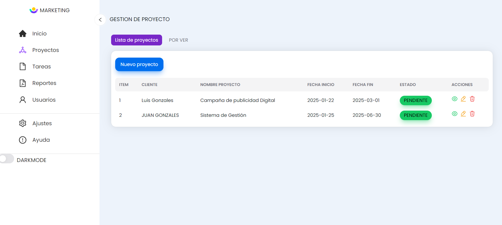

# SISTEMA DE GESTION DE PROYECTOS

El proyecto de gestión de proyectos está actualmente en proceso de desarrollo utilizando las siguientes tecnologías:

- **React**  
- **Node.js** 

## Tecnologías utilizadas:
- **React** para la creación de la interfaz de usuario.
- **Node.js** para la parte del servidor y la API.

